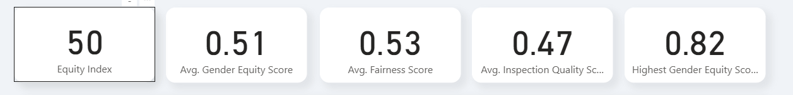
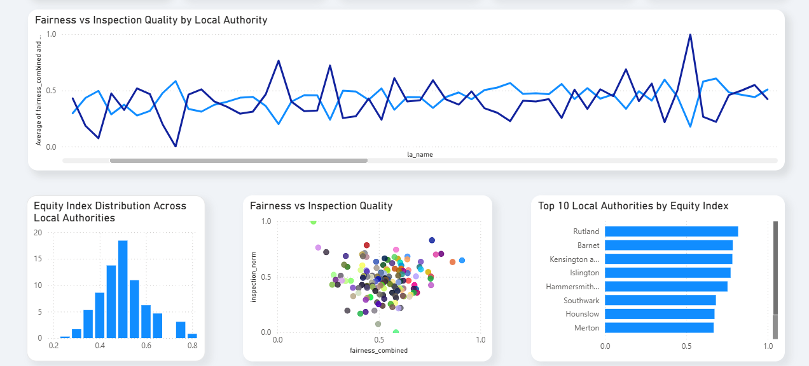

# 🎓 Educational Equity Index Dashboard

**AI-powered insights into fairness, inspection quality, and gender equity across Local Authorities in England**  

This repository contains the **data, code, methodology, and Power BI dashboard** for the **Educational Equity Index**.  
It demonstrates how **AI and data science methods** can be applied to social policy, enabling stakeholders to measure, compare, and act on educational equity.  

---

## 📌 Project Background

Educational outcomes in England vary widely by Local Authority (LA). While data on inspections, gender equity, and fairness exist, these measures are often **fragmented, complex, and hard to interpret**.  

The **Educational Equity Index** addresses this by:  
- **Combining multiple indicators** (fairness, inspection quality, gender equity) into one interpretable score (0–100).  
- **Making results accessible** through a Power BI dashboard.  
- **Supporting policymakers, researchers, and stakeholders** with actionable insights.  

---

## 🗂 Repository Structure

ai-equity-index/
├─ data/
│ ├─ raw/ # e.g., 2223_la_data_revised.csv
│ └─ processed/
│ └─ refined_gender_equity_index.csv
├─ notebooks/
│ └─ gender_equity_model.ipynb
├─ src/
│ ├─ features/engineering.py
│ └─ index/compute.py
├─ research/
│ ├─ bounds_literature.md
│ └─ assumptions_register.md
├─ docs/
│ ├─ methodology.md
│ ├─ data_dictionary.md
│ └─ dashboard_guide.md
├─ powerbi/
│ ├─ Gender equity dashboard.pbi
│ └─ equity_index_export.csv
├─ tests/
│ └─ test_index_compute.py
├─ LICENSE
└─ README.md

---

## ⚙️ How to Run

### Option A — Reproduce with Python
1. Clone the repository:
   ```bash
   git clone <repo-url>
   cd ai-equity-index

2. Create a virtual environment:
    python -m venv .venv
   source .venv/bin/activate   # Windows: .\.venv\Scripts\Activate.ps1

3. Install dependencies:
   pip install -r requirements.txt

4. Run the pipeline
   python -m src.features.engineering
   python -m src.index.compute
   python -m src.index.export_powerbi

5. Run tests
   pytest

---
Option B — Use Power BI Only

Open powerbi/equity_index_dashboard.pbix.

Ensure the dataset points to data/processed/refined_gender_equity_index.csv.

Refresh.

Use the Equity Index (0–100) field in KPI cards and charts.

---

📊 Dashboard Features

## 📸 Dashboard Preview

### KPI Summary


### Charts



See docs/dashboard_guide.md
 for full details.
 
---

🔬 Methodology

Indicators: fairness, inspection quality, gender equity.

Normalization: all indicators are scaled to [0,1].

Weighting: equal weight per indicator for transparency.

Outputs: interpretable 0–100 scores, supported by visual analytics.

See docs/methodology.md

---

📑 Documentation

Data Dictionary

Methodology

Dashboard Guide

Bounds Literature

Assumptions Register

---

✅ Testing & Reproducibility

Includes a pytest suite (tests/) verifying the Equity Index computation.

Ensures transparency and credibility for academic, professional, and visa submission use.

---

📌 Impact Statement

This project demonstrates how AI and data science can be applied to education policy in the UK:

Transparency: transforms complex educational data into interpretable metrics.

Equity: identifies Local Authorities where fairness and inspection quality diverge.

Benchmarking: highlights high-performing areas for replication and learning.

It directly supports the UK’s innovation agenda by showing how AI-powered methods can strengthen social equity, accountability, and decision-making.

